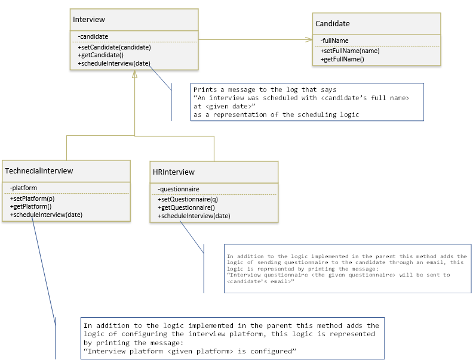
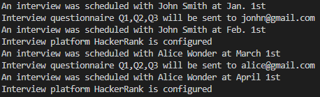

# Mini Project 1

Use the class notation to implement what's shown in the given diagram

## Using the classes

Use the classes you create to schedule the techncial and HR interview for two candidates according to the following:

* candidate 1 - full name: "John Smith", email: 'jonhn@gmail.com'

* candidate 2 - full name: "Alice Wonder", email: 'alice@gmail.com'

* set the HR interview questions to the array of strings 'Q1', 'Q2' and 'Q3'

* set the plateform for the techncial interview to be 'HackerRank'

* Schedule the interviews for candidate 1  - hrInterview on Jan. 1st and tech Interview on Feb. 1st for simplicity you just consider the dates as simple strings.

* Schedule interviews for candiate 2 - hrInterview on March. 1st and tech Interview on April 1stfor simplicity you just consider the dates as simple strings.

## Expected Output

